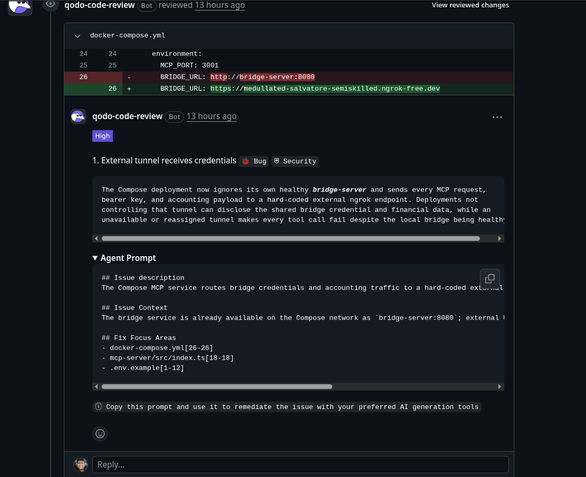
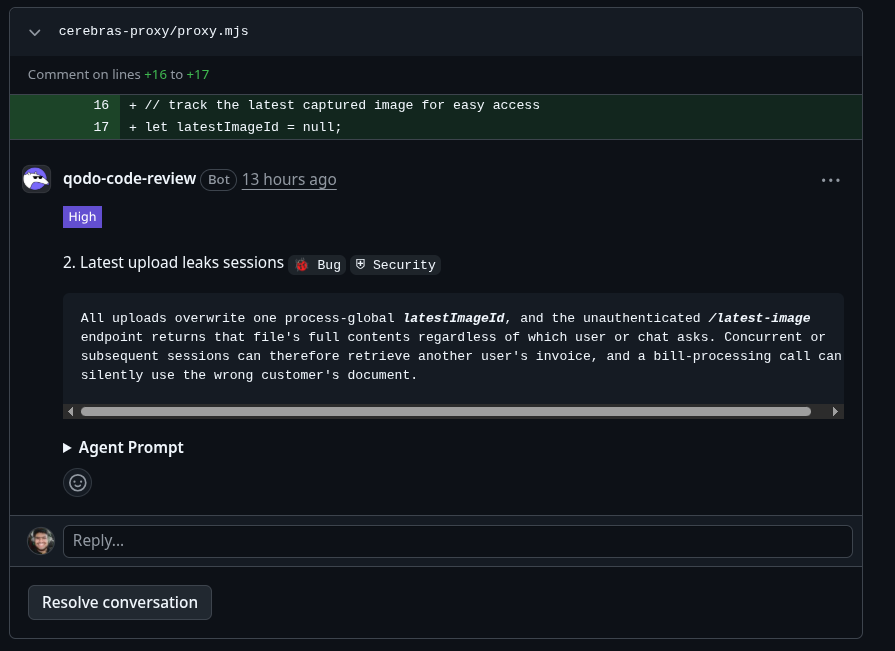
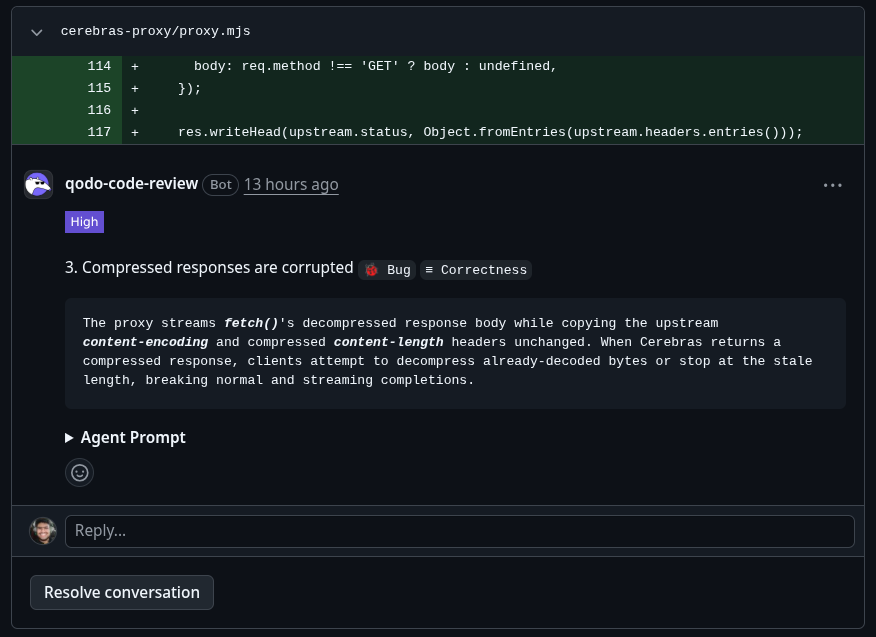
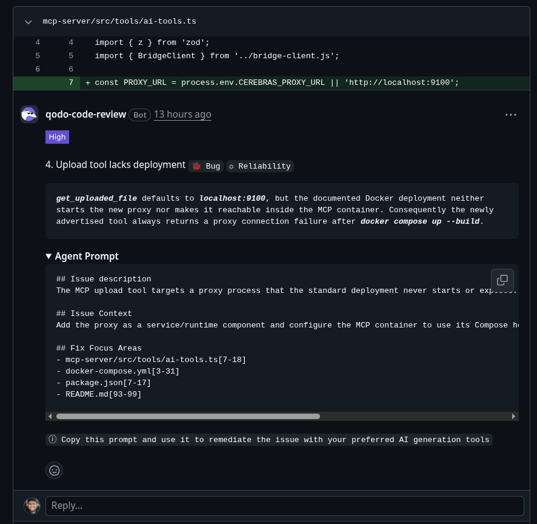
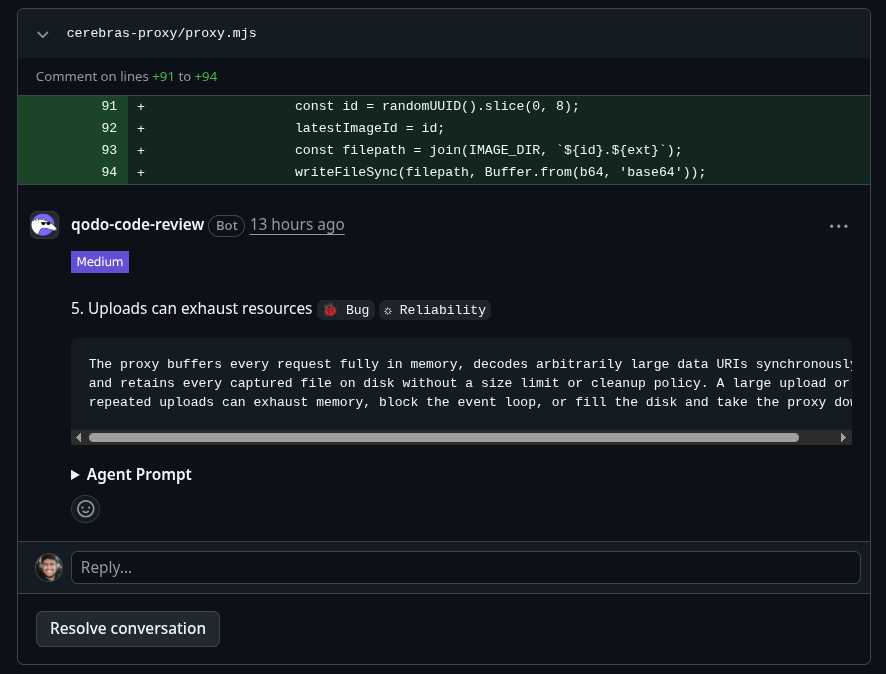
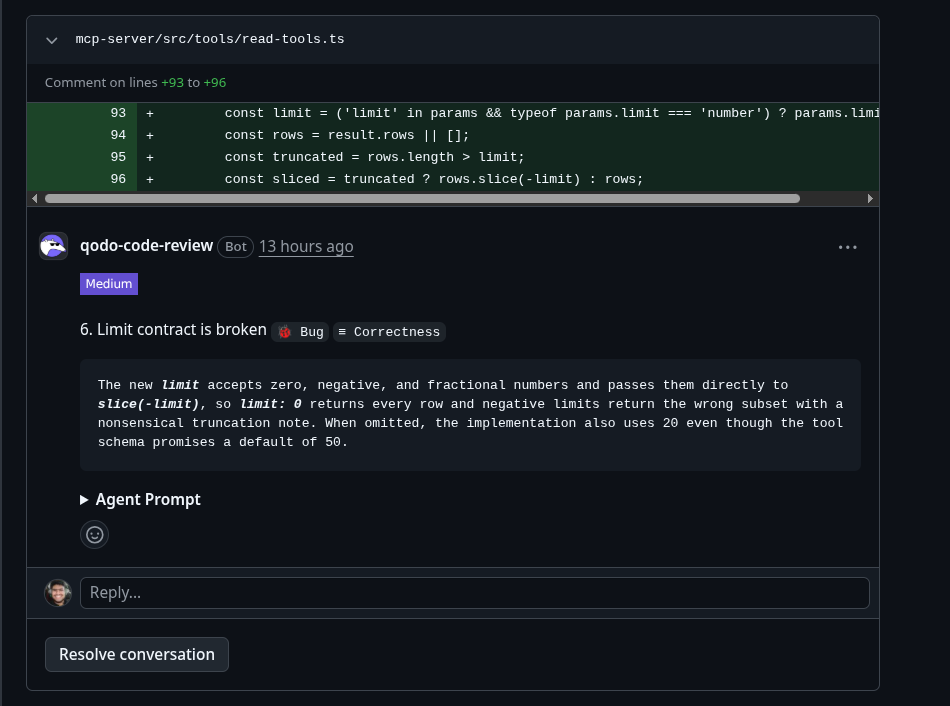
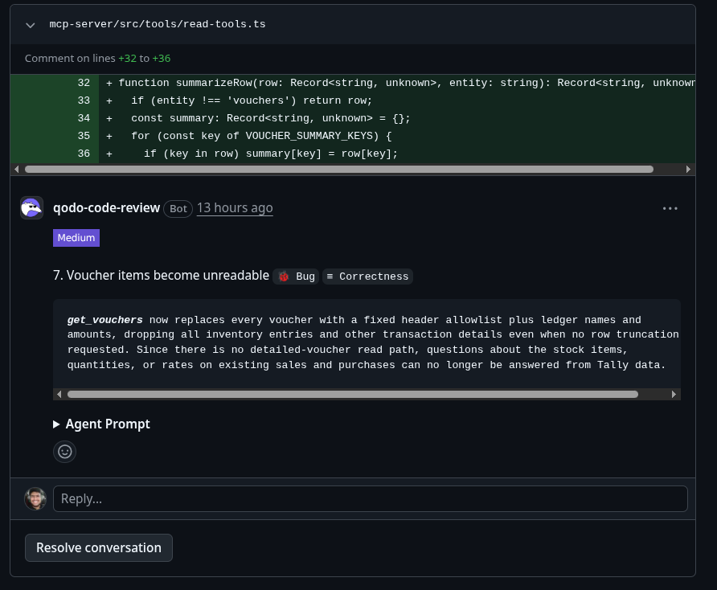

# tallyforge

an ai accounting agent for tallyprime, built on trueforge.

it connects the trueforge agent harness to tallyprime (india's most used accounting software) through a custom mcp server. the agent can read your books, create vouchers, process purchase bills from photos, and do financial analysis, all with human approval before any write hits your accounts.

## how it works

```
trueforge chat ui (browser)
    |
    v
tally mcp server (23 tools)
    |
    v
tally bridge server (rest api)
    |  websocket
    v
desktop agent (your pc)
    |  http xml
    v
tallyprime (localhost:9000)
```

the desktop agent runs on your pc next to tally and dials out to the bridge server over websocket. this means no port forwarding or public ip needed. the mcp server translates trueforge tool calls into bridge api requests.

## what it can do

**read (no approval needed)**
- list companies, ledgers, groups, stock items, vouchers, and more
- pull profit and loss, balance sheet, ratio analysis reports
- filter by date range and company

**write (needs your approval every time)**
- create vouchers (sales, purchase, payment, receipt, journal)
- create ledger accounts with gst details
- create stock items, stock groups, units

**ai powered**
- extract bill data from photos using ocr
- full 7 step bill processing: ocr, validate, create vendor, create stock items, check math, post voucher

## trueforge features used

- **mcp tool routing** - 23 custom tools (16 read + 5 write + 2 ai)
- **human approval gates** - all write tools pause for user confirmation
- **sandbox code execution** - python scripts for financial analysis and charts
- **subagents** - parallel data fetching (compare two quarters at once)
- **context compaction** - handles long accounting sessions with large data
- **large tool response offloading** - ledger lists with hundreds of entries
- **ask user questions** - clarify company, dates, voucher details

## quick start

### what you need

- node.js 22+
- tallyprime running with xml access enabled
- the desktop agent connected to tally
- a google gemini api key (free tier works)

### setup

```bash
git clone https://github.com/reaim85/trueforge-tally.git
cd trueforge-tally
cp .env.example .env
# fill in your keys in .env

npm install
npm run build
```

### run without docker

start the bridge server:
```bash
BRIDGE_API_KEY=your-key GEMINI_API_KEY=your-gemini-key npm run start:bridge
```

start the mcp server:
```bash
BRIDGE_URL=http://localhost:8080 BRIDGE_API_KEY=your-key BRIDGE_AGENT_ID=your-agent-id npm run start:mcp
```

start trueforge:
```bash
npx @truefoundry/trueforge@latest
```

then open http://localhost:8790, add gemini as model provider, add the tally mcp server at http://localhost:3001/mcp, and start chatting.

### run with docker

```bash
docker compose up --build
```

then start trueforge separately and connect to the mcp server.

### connecting tally

1. open tallyprime
2. go to gateway of tally > f1 help > settings > connectivity
3. enable xml access on port 9000
4. start the desktop agent (from the tally-sync-agent project)
5. point it at your bridge server url

## project structure

```
trueforge-tally/
  mcp-server/          the mcp server that trueforge talks to
  bridge-server/       rest api bridge to the desktop agent
  skill/               accounting knowledge for the agent
  agent-spec.json      trueforge agent definition
  docker-compose.yml   one command setup
```

## about the tally desktop connector

the desktop agent that connects to tallyprime on your pc is a separate closed source project. it's being developed further and will be open sourced once stable. for now you need it running alongside tally to use tallyforge. if you want to try the project without tally, the mcp server still responds to tool calls and you can see the full tool schema and agent behavior through trueforge.

## ai disclosure

this project uses ai coding assistants (claude code) for development. all code has been reviewed and understood by the developer.

## qodo code review evidence

**pull request:** [PR #___](https://github.com/reaim85/trueforge-tally/pull/1) (v1 branch into main)

qodo reviewed the pr and found 7 issues (4 high, 3 medium). here is each finding with what i did about it.

### 1. external tunnel receives credentials (high, security)



docker-compose.yml routes bridge traffic to a hardcoded ngrok tunnel instead of the local bridge-server container.

**decision:**

---

### 2. latest upload leaks sessions (high, security)



the proxy uses a single global `latestImageId` so any session can access another session's uploaded file.

**decision:**

---

### 3. compressed responses are corrupted (high, correctness)



the proxy streams `fetch()`'s decompressed body but copies the upstream `content-encoding` and `content-length` headers unchanged, breaking compressed responses.

**decision:**

---

### 4. upload tool lacks deployment (high, reliability)



`get_uploaded_file` defaults to `localhost:9100` but the docker deployment doesn't start or expose the proxy, so the tool always fails after `docker compose up`.

**decision:**

---

### 5. uploads can exhaust resources (medium, reliability)



the proxy buffers every request in memory and writes captured files synchronously with no size limit or cleanup, which can exhaust memory or disk.

**decision:**

---

### 6. limit contract is broken (medium, correctness)



the `limit` param accepts zero, negative, and fractional numbers. `limit: 0` returns every row, negative limits return the wrong subset. the schema says default is 50 but the code uses 20.

**decision:**

---

### 7. voucher items become unreadable (medium, correctness)



`get_vouchers` strips all fields except a fixed allowlist, dropping inventory entries and other transaction details even when no truncation was requested.

**decision:**

---

### review timeline

1. pushed initial pr with all hackathon code
2. qodo ran automated review and posted 7 findings
3. addressed the issues (fixed or dismissed with reasoning)
4. qodo re-reviewed the final code
5. merged to main

## license

mit
